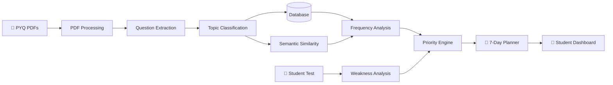

# 🍞 EXAM BREAD

### Turn 5 years of PYQs into a 7-day study plan.

> **Upload your Previous Year Question Papers → Find what matters → Find what you're weak at → Get a focused study plan.**

---

## 🧠 The idea

We all know the situation.

You have **5 years of PYQs**, your exam is coming, and you're sitting there thinking:

> *"Bro... what the hell am I supposed to study first?"* 😭

Going through every paper manually is annoying. Finding repeated topics takes time. And even after finding them, you still don't know whether **you are actually good at those topics**.

So we built **EXAM BREAD**.

It looks at:

**What gets asked often**
⬇️
**What you're weak at**
⬇️
**What you should study first**

---

# ⚡ How it works

```text
        📄 2021 PYQ
        📄 2022 PYQ
        📄 2023 PYQ
        📄 2024 PYQ
        📄 2025 PYQ
              │
              ▼
       ┌───────────────┐
       │ PDF PROCESSOR │
       └───────┬───────┘
               ▼
      📝 Extract Questions
               │
               ▼
       🧠 Find Topics
               │
        ┌──────┴──────┐
        ▼             ▼
   📊 Frequency    🔍 Similarity
        │             │
        └──────┬──────┘
               ▼
       🎯 Student Weakness
               │
               ▼
        ⭐ PRIORITY SCORE
               │
               ▼
        📅 7-DAY PLAN
```

That's basically the entire product.

---

# 👀 What the student sees

## 1. Upload

Drop your five PYQs.

```text
┌─────────────────────────────────────┐
│                                     │
│          📄 Drop your PYQs          │
│                                     │
│     Upload up to 5 PDF papers       │
│                                     │
│             [ Upload ]              │
│                                     │
└─────────────────────────────────────┘
```

The system processes the papers and extracts individual questions.

---

## 2. We find the topics

Instead of giving you a giant list of questions, EXAM BREAD groups them.

Example:

```text
OPERATING SYSTEMS
│
├── 🔴 Deadlocks
│     ├── Prevention
│     ├── Avoidance
│     ├── Banker's Algorithm
│     └── Detection
│
├── 🟠 CPU Scheduling
│     ├── FCFS
│     ├── SJF
│     └── Round Robin
│
├── 🟡 Synchronization
│     ├── Semaphores
│     └── Critical Section
│
└── 🟢 Memory Management
      ├── Paging
      └── Segmentation
```

---

# 📊 3. See what the examiner keeps asking

The frequency dashboard gives a quick picture of the last five years.

### Example

```text
Topic Frequency
──────────────────────────────────────

Deadlocks          ████████████  12
Synchronization    ██████████    10
Scheduling         ████████       8
Memory Management  █████          5
File Systems       ███            3
```

We also show the **year-wise distribution**.

| Topic           | 2021 | 2022 | 2023 | 2024 | 2025 |
| :-------------- | ---: | ---: | ---: | ---: | ---: |
| Deadlocks       |    2 |    3 |    2 |    3 |    2 |
| Scheduling      |    1 |    2 |    2 |    1 |    2 |
| Synchronization |    2 |    1 |    3 |    2 |    2 |
| Memory          |    1 |    1 |    1 |    1 |    1 |

So instead of saying:

> "Deadlocks is important."

we can actually show:

> **"Deadlocks appeared 12 times in the last 5 papers."**

---

# 🔁 4. Different question. Same concept.

This is one of the useful parts of EXAM BREAD.

Examiners don't always repeat a question word-for-word.

For example:

### 2022

> Explain Banker's Algorithm with an example.

### 2024

> Explain deadlock avoidance using Banker's Algorithm.

They look different.

But they're testing the same thing.

EXAM BREAD uses semantic similarity to connect questions like these.

```text
2022 ──┐
       ├──► BANKER'S ALGORITHM
2024 ──┘

        Same underlying concept
```

This helps identify **concept repetition**, not just exact repeated sentences.

---

# 🎯 5. Frequency isn't enough

This is where things get interesting.

Imagine:

```text
                 EXAM FREQUENCY
                       ↑
                       │
              🔴       │       🔴
          Scheduling   │    Deadlocks
                       │
              🟡       │
       Synchronization │
                       │
          🟢           │
       File Systems    │
                       └────────────────→
                            WEAKNESS
```

A topic that appears frequently is important.

A topic that appears frequently **and you're bad at it** is much more important.

---

# 🧪 6. Find your weak topics

The student can take a short diagnostic test.

Example result:

| Topic             | Your Score |
| :---------------- | ---------: |
| Deadlocks         |  **42% ❌** |
| Scheduling        |  **48% ❌** |
| Synchronization   |    **76%** |
| Memory Management |  **82% ✅** |

Now we have two pieces of information:

### Exam

> What is asked frequently?

### Student

> What do you struggle with?

---

# ⭐ 7. Priority Engine

We combine both.

```text
       HOW OFTEN IS IT ASKED?
                  +
       HOW WEAK ARE YOU?
                  │
                  ▼
          ┌─────────────┐
          │   PRIORITY  │
          │    SCORE    │
          └──────┬──────┘
                 ▼
           WHAT TO STUDY
              FIRST
```

Example:

| Topic              | Exam Frequency | Weakness | Priority |
| :----------------- | :------------: | :------: | :------: |
| 🔴 Deadlocks       |    Very High   |   High   |  **92**  |
| 🔴 Scheduling      |      High      |   High   |  **88**  |
| 🟡 Synchronization |      High      |  Medium  |  **74**  |
| 🟢 Memory          |     Medium     |    Low   |  **41**  |

So the system doesn't just say:

> "Here are your topics."

It says:

> **"Start with Deadlocks."**

And tells you why.

---

# 📅 8. Your 7-day plan

Finally, everything comes together.

### DAY 1

🔴 **Deadlocks**

**Why:** Very frequent + weak area

* Deadlock conditions
* Prevention
* Avoidance
* 3 PYQs

---

### DAY 2

🔴 **Banker's Algorithm**

* Concept
* Numerical problems
* Previous questions

---

### DAY 3

🔴 **CPU Scheduling**

* FCFS
* SJF
* Round Robin
* PYQ practice

---

### DAY 4

🟡 **Synchronization**

* Semaphores
* Critical sections
* Classical problems

---

### DAY 5

🟡 **Memory Management**

* Paging
* Segmentation
* Virtual memory

---

### DAY 6

🔥 **Revision Day**

Focus on:

* Weak topics
* Frequently repeated concepts
* Important PYQs

---

### DAY 7

📝 **Mock Test**

A PYQ-based test weighted towards the topics that matter most.

---

# 🏗️ Architecture



---

# 🧩 Tech Stack

We're keeping the stack simple and modular.

| Part            | Technology              |
| :-------------- | :---------------------- |
| Frontend        | React / Next.js         |
| Styling         | Tailwind CSS            |
| Backend         | Python + FastAPI        |
| Database        | PostgreSQL              |
| PDF Processing  | Python PDF libraries    |
| NLP             | Python NLP / Embeddings |
| Charts          | Recharts / Chart.js     |
| Version Control | Git + GitHub            |

> The exact implementation can evolve during development; the important part is keeping PDF processing, analytics, AI/NLP, and planning as separate components.

---

# 🔍 What actually happens behind the scenes?

Suppose the system receives this:

```text
"Explain deadlock prevention techniques."
```

It becomes structured data:

```json
{
  "year": 2025,
  "question": "Explain deadlock prevention techniques.",
  "marks": 10,
  "topic": "Deadlocks",
  "subtopic": "Deadlock Prevention"
}
```

After processing all papers, we can calculate things like:

```text
Deadlocks
───────────────
2021 → 2
2022 → 3
2023 → 2
2024 → 3
2025 → 2

Total → 12
```

Then we combine it with the student's performance:

```text
Exam Frequency : 95%
Student Score  : 42%

        ↓

Priority : HIGH 🔴
```

And that eventually becomes:

```text
DAY 1 → DEADLOCKS
```

---

# 🚫 Why this isn't just an AI wrapper

One of the important hackathon rules is:

> **"No direct wrapper of a single API."**

EXAM BREAD is designed around an actual processing pipeline.

```text
                  ❌ NOT THIS

             Frontend
                 ↓
             AI API
                 ↓
              Answer
```

Instead:

```text
                   ✅ EXAM BREAD

                  PYQ PDFs
                      ↓
                PDF Processing
                      ↓
              Question Extraction
                      ↓
                Topic Modeling
                      ↓
               Database Storage
                      ↓
        ┌─────────────┴─────────────┐
        ↓                           ↓
 Frequency Analysis          Similarity Analysis
        ↓                           ↓
        └─────────────┬─────────────┘
                      ↓
              Student Assessment
                      ↓
               Weakness Analysis
                      ↓
                Priority Engine
                      ↓
                Study Planner
                      ↓
                7-Day Strategy
```

AI/NLP is used where it actually helps, while the application itself handles the data, calculations, storage, ranking, and planning.

---

# 📁 Repository Structure

```text
exam-bread/
│
├── frontend/
│   ├── components/
│   ├── pages/
│   ├── services/
│   └── utils/
│
├── backend/
│   ├── api/
│   ├── models/
│   ├── processors/
│   ├── analytics/
│   ├── ai/
│   └── main.py
│
├── data/
│   └── sample/
│
├── tests/
│
├── docs/
│
├── .env.example
├── .gitignore
├── docker-compose.yml
├── requirements.txt
├── package.json
└── README.md
```

---

# ▶️ Run locally

### Clone

```bash
git clone https://github.com/YOUR-USERNAME/exam-bread.git

cd exam-bread
```

### Backend

```bash
cd backend

python -m venv venv
source venv/bin/activate

pip install -r requirements.txt

uvicorn main:app --reload
```

### Frontend

```bash
cd frontend

npm install
npm run dev
```

---

# 🔐 Environment Variables

Create a `.env` file locally.

Example:

```env
DATABASE_URL=your_database_url
AI_API_KEY=your_api_key
```

**Never commit `.env` to GitHub.**

Use `.env.example` instead.

---

# 🧪 Testing

We plan to test the important parts independently:

```text
✓ PDF extraction
✓ Question segmentation
✓ Topic classification
✓ Frequency calculation
✓ Similar-question detection
✓ Priority scoring
✓ Study-plan generation
✓ API validation
```

---

# 🎬 Hackathon Demo

The ideal demo is intentionally simple:

### 01 — Upload

> "Here are my five PYQs."

### 02 — Analyze

> "We found 143 questions and grouped them into 31 topics."

### 03 — Discover

> "Deadlocks appeared 12 times."

### 04 — Test

> "You're only scoring 42% on Deadlocks."

### 05 — Prioritize

> "Deadlocks is your highest-priority topic."

### 06 — Plan

> "Here's exactly what you should study for the next 7 days."

---

# 💭 Why we built this

We didn't want to make another chatbot that says:

> *"Here is a summary of your syllabus."*

We wanted something more practical.

A student doesn't necessarily need **more information**.

They need to know:

> **What should I study right now?**

That's what EXAM BREAD tries to solve.

---

# 🚀 Future Ideas

If we get more time, we'd love to add:

* 📚 Multiple subjects
* 📝 Automatic mock-test generation
* 📈 Progress tracking
* 🧠 Adaptive quizzes
* 🔄 Spaced repetition
* 📋 Automatic syllabus mapping
* 🎯 Exam-date-aware planning
* 📱 Mobile version
* 👨‍🏫 Teacher dashboard

---

# 👨‍💻 Team

| Member       | Responsibility          |
| :----------- | :---------------------- |
| **Member 1** | Frontend / UI           |
| **Member 2** | Backend / Database      |
| **Member 3** | AI / NLP                |
| **Member 4** | Analytics / Integration |

Replace the placeholders with the actual team members.

---

# 🏁 The one-line pitch

> ### **EXAM BREAD turns five years of PYQs and your own weaknesses into one focused 7-day study plan.**

---

<p align="center">

### 🍞 EXAM BREAD

**Study less randomly. Study what actually matters.**

</p>
